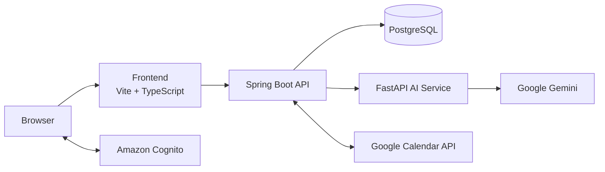

# AI Task Manager

AI Task Manager is a personal project that combines calendar management with an AI planning assistant.

Users can manage events in a local calendar or connect Google Calendar, then ask the assistant to propose calendar changes using natural language. Proposed changes are shown for confirmation before they are applied.

## Features

- Sign in through Amazon Cognito using OpenID Connect.
- Monthly calendar and task-list views.
- Create, edit, delete, and reschedule events with drag and drop.
- Choose between a PostgreSQL-backed local calendar and Google Calendar.
- AI-assisted planning based on the user's calendar, current date and time, preferences, and conversation history.
- Structured `CREATE_EVENT`, `UPDATE_EVENT`, and `DELETE_EVENT` proposals.
- User confirmation before AI-proposed changes are executed.
- Configurable daily AI request quota.

## Architecture



### Frontend

Built with Vite and TypeScript. It renders the calendar and assistant UI, handles Cognito sign-in, and sends authenticated requests to Spring Boot.

The production image serves the built frontend with Nginx.

### Spring Boot

Acts as the main application backend.

It validates Cognito access tokens, applies business rules, manages users and calendar providers, and is the only service allowed to execute calendar changes.

### FastAPI

Handles communication with the AI provider.

It receives the calendar context from Spring Boot and requests a schema-constrained planning response from Gemini. It does not modify calendars directly.

### PostgreSQL

Stores:

- users;
- local calendar events;
- selected calendar provider;
- AI quota state;
- encrypted Google OAuth tokens.

### External services

**Amazon Cognito** provides user authentication and access tokens for the API.

**Google Calendar** provides the optional external calendar implementation. Users can switch back to the local calendar at any time.

**Google Gemini** converts calendar context and natural-language requests into structured proposed actions.

## AI Calendar Flow

1. The user signs in and selects either the local or Google calendar provider.
2. The user sends a request to the assistant.
3. Spring Boot loads the user's calendar events and adds the current date, time, weekday, timezone, preferences, and recent conversation history.
4. Spring Boot sends this context to FastAPI.
5. FastAPI asks Gemini for a structured response containing a short explanation and optional `CREATE_EVENT`, `UPDATE_EVENT`, or `DELETE_EVENT` actions.
6. FastAPI validates the response schema, and Spring Boot performs additional checks against the current calendar.
7. The frontend displays the proposed changes.
8. Calendar changes are executed only after the user confirms them.
9. Spring Boot routes the approved actions to the selected calendar provider.

## Tech Stack

| Area | Technologies |
| --- | --- |
| Frontend | TypeScript, Vite, Tailwind CSS, `oidc-client-ts`, Nginx |
| Main backend | Java 21, Spring Boot, Spring Security, Spring Data JPA, Maven |
| AI service | Python, FastAPI, Pydantic, Uvicorn, Google Gen AI SDK |
| Database | PostgreSQL |
| Integrations | Amazon Cognito, Google Calendar API, Google Gemini |
| Deployment | Docker, Docker Compose |

## Running with Docker Compose

### Prerequisites

- Docker Engine with the Docker Compose plugin.
- An Amazon Cognito user pool and public app client.
- Google OAuth credentials with Calendar access.
- A Gemini API key.

### Setup

Clone the repository and create the root environment file:

```bash
git clone <repository-url>
cd ai-task-manager
cp .env.example .env
```

Fill in the required values in `.env`.

Generate the Google token-encryption key once and keep it stable:

```bash
openssl rand -base64 32
```

For a local Docker deployment, use:

```env
FRONTEND_ORIGIN=http://localhost:8081
FRONTEND_URL=http://localhost:8081/
PUBLIC_BACKEND_URL=http://localhost:8080
GOOGLE_REDIRECT_URI=http://localhost:8080/login/oauth2/code/google
```

Cognito must allow:

```text
http://localhost:8081/callback.html
```

as a callback URL, and:

```text
http://localhost:8081/sign-in.html
```

as a sign-out URL.

Google OAuth must allow:

```text
http://localhost:8080/login/oauth2/code/google
```

as the redirect URI.

### Start the application

```bash
docker compose up -d --build
```

Open:

```text
http://localhost:8081
```

Check the running services:

```bash
docker compose ps
```

View logs:

```bash
docker compose logs -f
```

The frontend is published on `127.0.0.1:8081` and Spring Boot on `127.0.0.1:8080`.

FastAPI and PostgreSQL are internal-only services.

PostgreSQL data is persisted in the `postgres_data` named volume.

### Stop the application

```bash
docker compose down
```

This stops and removes the containers without deleting the PostgreSQL volume.

> Do not use `docker compose down -v` unless you intentionally want to delete the PostgreSQL data volume.

## Security

The API requires Cognito access tokens and validates their issuer, client, token type, and subject.

Calendar operations are scoped to the authenticated user, including ownership checks for local events.

Google access and refresh tokens are encrypted with AES-256-GCM before being stored.

AI responses are treated as untrusted input: proposed actions are schema-validated, checked again by Spring Boot against the user's current events, and require explicit user confirmation before execution.